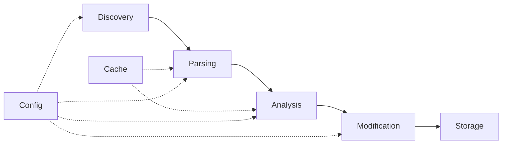

# Architecture Overview

This chapter provides an in-depth look at uzpy's architecture, design principles, and how the various components work together to analyze code and update docstrings.

## System Architecture

uzpy follows a modular, pipeline-based architecture with five main stages:



### Core Components

1. **Discovery** (`uzpy.discovery`): Finds Python files to analyze
2. **Parsing** (`uzpy.parser`): Extracts code constructs from Python files
3. **Analysis** (`uzpy.analyzer`): Finds where constructs are used
4. **Modification** (`uzpy.modifier`): Updates docstrings with usage information
5. **Caching** (`uzpy.cache`): Speeds up repeated analysis
6. **Configuration** (`uzpy.settings`): Manages settings and options

## Data Flow

### 1. File Discovery Phase

The discovery phase identifies which Python files to process:

```python
# uzpy/discovery.py
class FileDiscovery:
    def discover_python_files(self, paths: list[Path]) -> list[Path]:
        """Find all Python files matching criteria."""
        # 1. Scan directories recursively
        # 2. Apply inclusion patterns (*.py, shebang files)  
        # 3. Apply exclusion patterns (.gitignore style)
        # 4. Return sorted list of files
```

**Discovery process:**

1. **Path expansion**: Convert input paths to absolute paths
2. **Recursive scanning**: Walk directory trees to find files
3. **Python file detection**: Identify `.py` files and files with Python shebangs
4. **Pattern filtering**: Apply inclusion and exclusion patterns
5. **Deduplication**: Remove duplicate files from multiple paths

### 2. Parsing Phase

The parsing phase extracts code constructs (functions, classes, methods, modules):

```python
# uzpy/parser/tree_sitter_parser.py
class TreeSitterParser:
    def parse_file(self, file_path: Path) -> list[Construct]:
        """Extract constructs from a Python file."""
        # 1. Parse file into Abstract Syntax Tree
        # 2. Walk AST to find definitions
        # 3. Extract metadata (name, line number, docstring)
        # 4. Build fully qualified names
        # 5. Return list of Construct objects
```

**Construct types:**

- **Modules**: Top-level Python files
- **Classes**: Class definitions
- **Functions**: Function definitions (top-level and nested)
- **Methods**: Class methods (instance, class, static)

**Metadata extracted:**

- Name and fully qualified name
- File path and line number
- Existing docstring content
- Function/method signatures
- Class hierarchy information

### 3. Analysis Phase

The analysis phase finds where each construct is used throughout the codebase:

```python
# uzpy/analyzer/base.py
class BaseAnalyzer:
    def find_references(self, construct: Construct, search_paths: list[Path]) -> list[Reference]:
        """Find all references to a construct."""
        # Implementation varies by analyzer type
```

**Reference types:**

- **Imports**: `from module import function`
- **Calls**: `function(args)`
- **Attribute access**: `obj.method()`
- **Inheritance**: `class Child(Parent)`
- **Type annotations**: `def func() -> MyClass`

### 4. Modification Phase

The modification phase updates docstrings with usage information:

```python
# uzpy/modifier/libcst_modifier.py
class LibCSTModifier:
    def update_docstring(self, construct: Construct, references: list[Reference]) -> None:
        """Update construct's docstring with usage information."""
        # 1. Parse file with LibCST (preserves formatting)
        # 2. Find the construct's definition node
        # 3. Extract and modify existing docstring
        # 4. Add/update "Used in:" section
        # 5. Write modified file back to disk
```

**Modification process:**

1. **Safe parsing**: Use LibCST to preserve all formatting
2. **Docstring extraction**: Find existing docstring or create new one
3. **Section management**: Add or update "Used in:" sections
4. **Reference formatting**: Format file paths and line numbers
5. **Safe writing**: Validate syntax before writing changes

## Component Details

### Discovery Component

**Purpose**: Efficiently find Python files while respecting exclusion patterns.

**Key features:**

- **Pattern matching**: Uses `pathspec` for `.gitignore`-style patterns
- **Shebang detection**: Identifies Python files without `.py` extension
- **Symlink handling**: Follows or ignores symlinks based on configuration
- **Performance optimization**: Skips known non-Python directories

**Default exclusions:**

```python
DEFAULT_EXCLUDE_PATTERNS = [
    "**/__pycache__/**",
    "**/.pytest_cache/**", 
    "**/.mypy_cache/**",
    "**/.git/**",
    "**/venv/**",
    "**/env/**",
    "**/.venv/**",
    "**/build/**",
    "**/dist/**",
    "**/*.egg-info/**",
    "**/.tox/**",
    "**/.nox/**",
    "**/*.pyc",
    "**/*.pyo",
    "**/*.pyd",
]
```

### Parser Component

**Purpose**: Extract code constructs and metadata from Python files.

**Tree-sitter advantages:**

- **Error tolerance**: Continues parsing despite syntax errors
- **Performance**: Very fast parsing of large files
- **Incremental parsing**: Can parse only changed portions
- **Language awareness**: Understands Python-specific syntax

**Construct identification:**

```python
# Examples of constructs uzpy can identify
class MyClass:                    # Class construct
    def method(self):             # Method construct
        pass
        
def top_level_function():         # Function construct
    def nested_function():        # Nested function construct
        pass

# Module-level construct (the file itself)
```

**Caching strategy:**

- **Content-based hashing**: Cache keys include file content hash
- **Modification time**: Invalidate cache when files change
- **Incremental updates**: Only re-parse changed files

### Analyzer Component

**Purpose**: Find where code constructs are used throughout the codebase.

#### Analyzer Types

**1. Modern Hybrid Analyzer** (default)

Uses multiple modern tools in a tiered approach:

```python
class ModernHybridAnalyzer:
    def analyze(self, construct: Construct) -> list[Reference]:
        # Tier 1: Quick ruff analysis
        if files_count < ruff_threshold:
            refs = self.ruff_analyzer.analyze(construct)
            if refs: return refs
            
        # Tier 2: Structural ast-grep analysis  
        if files_count < astgrep_threshold:
            refs = self.astgrep_analyzer.analyze(construct)
            if refs: return refs
            
        # Tier 3: Deep pyright analysis
        if files_count < pyright_threshold:
            refs = self.pyright_analyzer.analyze(construct)
            
        return refs
```

**Advantages:**
- High accuracy for modern Python codebases
- Good performance through tiered analysis
- Type-aware reference finding

**2. Traditional Hybrid Analyzer**

Combines Jedi and Rope for reliable analysis:

```python
class HybridAnalyzer:
    def analyze(self, construct: Construct) -> list[Reference]:
        # Fast Jedi analysis first
        jedi_refs = self.jedi_analyzer.analyze(construct)
        
        # Fallback to thorough Rope analysis
        if not jedi_refs or len(jedi_refs) < threshold:
            rope_refs = self.rope_analyzer.analyze(construct)
            return self.merge_references(jedi_refs, rope_refs)
            
        return jedi_refs
```

**Advantages:**
- Well-tested and reliable
- Good balance of speed and accuracy
- Fewer external dependencies

**3. Individual Analyzers**

Each analyzer has specific strengths:

- **Jedi**: Fast, good for autocompletion-style analysis
- **Rope**: Thorough, excellent for refactoring scenarios
- **Pyright**: Type-aware, modern Python features
- **ast-grep**: Structural pattern matching
- **Ruff**: Fast linting-based analysis

#### Reference Resolution

**Import analysis:**

```python
# Direct imports
from mymodule import myfunction
import mymodule.myfunction

# Aliased imports
from mymodule import myfunction as func
import mymodule.myfunction as func

# Star imports (best effort)
from mymodule import *
```

**Call analysis:**

```python
# Direct calls
myfunction()
obj.mymethod()

# Indirect calls
func = myfunction
func()

# Method calls through inheritance
class Child(Parent):
    def method(self):
        super().parent_method()  # Reference to parent_method
```

### Modifier Component

**Purpose**: Safely update docstrings while preserving code formatting.

**LibCST advantages:**

- **Lossless parsing**: Preserves all whitespace, comments, and formatting
- **Safe transformations**: Maintains syntactic correctness
- **Precise targeting**: Can modify specific nodes without affecting others

**Docstring formats supported:**

```python
# Google style (default)
def function():
    """
    Brief description.
    
    Args:
        param: Description.
        
    Returns:
        Description.
        
    Used in:
    - file1.py
    - file2.py
    """

# NumPy style
def function():
    """
    Brief description.
    
    Parameters
    ----------
    param : type
        Description.
        
    Returns  
    -------
    type
        Description.
        
    Used in
    -------
    - file1.py
    - file2.py
    """

# Sphinx style
def function():
    """
    Brief description.
    
    :param param: Description.
    :returns: Description.
    
    .. note::
       Used in:
       
       - file1.py
       - file2.py
    """
```

**Safe modification process:**

1. **Syntax validation**: Parse with LibCST before and after changes
2. **Backup creation**: Optional backup of original files
3. **Atomic updates**: Write to temporary file, then rename
4. **Error recovery**: Restore original on any failure

### Caching System

**Purpose**: Speed up repeated analysis through intelligent caching.

**Cache layers:**

1. **Parser cache**: Stores parsed construct lists per file
2. **Analyzer cache**: Stores reference lists per construct
3. **File metadata cache**: Stores file modification times and hashes

**Cache invalidation:**

```python
# Parser cache key
cache_key = f"{file_path}:{file_mtime}:{content_hash}"

# Analyzer cache key  
cache_key = f"{construct.full_name}:{construct.file_path}:{search_paths_hash}"
```

**Cache management:**

- **Size limits**: Configurable maximum cache size
- **TTL (Time To Live)**: Automatic expiration of old entries
- **LRU eviction**: Least Recently Used items removed first
- **Compression**: Optional compression for large cache entries

## Design Principles

### 1. Modularity

Each component has a clear, single responsibility:

- **Parsers** only extract constructs
- **Analyzers** only find references  
- **Modifiers** only update docstrings
- **Discovery** only finds files

This allows for easy testing, replacement, and extension of individual components.

### 2. Performance

**Caching strategy:**
- Cache expensive operations (parsing, analysis)
- Intelligent cache invalidation
- Configurable cache limits

**Parallel processing:**
- Analyze multiple constructs concurrently
- Process files in parallel where safe
- Configurable worker pool sizes

**Memory efficiency:**
- Stream large files instead of loading entirely
- Lazy loading of analyzer backends
- Configurable memory limits

### 3. Safety

**Code preservation:**
- Use LibCST for lossless code transformations
- Validate syntax before and after modifications
- Optional backup creation

**Error handling:**
- Graceful degradation when analyzers fail
- Continue processing other files on errors
- Detailed error reporting and logging

### 4. Extensibility

**Plugin architecture:**
- Well-defined interfaces for analyzers and modifiers
- Easy to add new analyzer backends
- Configurable analyzer selection and fallbacks

**Configuration system:**
- Extensive configuration options
- Environment variable support
- Profile-based configurations

## Performance Characteristics

### Typical Performance

For a medium-sized project (1000 files, 100k LOC):

- **Discovery**: < 1 second
- **Parsing**: 2-5 seconds (cached: < 1 second)
- **Analysis**: 10-30 seconds (cached: 2-5 seconds)
- **Modification**: 1-3 seconds
- **Total**: 15-40 seconds (cached: 5-10 seconds)

### Scaling Factors

**File count**: Linear scaling with number of files to analyze
**Codebase complexity**: Some analyzers scale with cross-file complexity
**Construct count**: Linear scaling with number of functions/classes
**Reference density**: More references = longer analysis time

### Optimization Strategies

**For large codebases:**

1. **Use caching**: Enable all cache layers
2. **Parallel processing**: Increase worker count
3. **Analyzer selection**: Choose faster analyzers for large projects
4. **Exclusion patterns**: Skip unnecessary files
5. **Incremental analysis**: Analyze only changed portions

## Error Handling

### Error Categories

1. **Discovery errors**: File permission issues, path not found
2. **Parsing errors**: Syntax errors in Python files
3. **Analysis errors**: Analyzer backend failures, timeouts
4. **Modification errors**: File write permissions, syntax corruption

### Recovery Strategies

**Graceful degradation:**
- Continue processing other files when one fails
- Fall back to simpler analyzers on complex analysis failures
- Skip problematic constructs but process others in same file

**Error reporting:**
- Detailed logging of all errors
- Summary of failures at end of analysis
- Exit codes indicating success/failure status

## Next Steps

Understanding uzpy's architecture prepares you for:

1. **[Using the API](06-api-reference.md)** programmatically
2. **[Extending uzpy](07-extending-uzpy.md)** with custom components
3. **[Optimizing performance](08-performance-optimization.md)** for your use case

The next chapter provides comprehensive API documentation for using uzpy as a library.