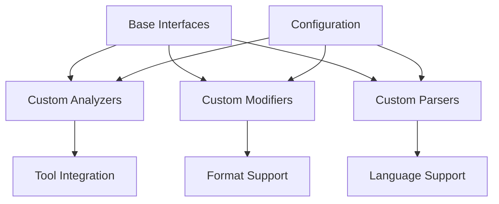

# Extending uzpy

This chapter covers how to extend uzpy with custom components, including custom analyzers, modifiers, and parsers. Learn how to integrate new tools and customize uzpy's behavior for your specific needs.

## Extension Architecture

uzpy uses a plugin-based architecture that makes it easy to extend with custom components:



All extensions follow the same pattern:

1. **Implement base interface** (e.g., `BaseAnalyzer`)
2. **Register with configuration system** (optional)
3. **Use through standard APIs** (pipeline, CLI, etc.)

## Custom Analyzers

The most common extension is creating custom analyzers to integrate new tools or analysis techniques.

### Basic Custom Analyzer

```python
# custom_analyzer.py
from pathlib import Path
from uzpy.analyzer.base import BaseAnalyzer
from uzpy.types import Construct, Reference

class MyCustomAnalyzer(BaseAnalyzer):
    """Custom analyzer using my preferred tool."""
    
    def __init__(self, custom_option: str = "default"):
        self.custom_option = custom_option
    
    def find_references(
        self, 
        construct: Construct, 
        search_paths: list[Path]
    ) -> list[Reference]:
        """Find references using custom logic."""
        references = []
        
        # Your custom analysis logic here
        for path in search_paths:
            if path.is_file() and path.suffix == '.py':
                refs = self._analyze_file(construct, path)
                references.extend(refs)
        
        return references
    
    def _analyze_file(self, construct: Construct, file_path: Path) -> list[Reference]:
        """Analyze a single file for references."""
        references = []
        
        try:
            content = file_path.read_text()
            
            # Example: Simple string search (replace with your tool)
            for line_num, line in enumerate(content.splitlines(), 1):
                if construct.name in line:
                    references.append(Reference(
                        file_path=file_path,
                        line_number=line_num,
                        column_number=line.find(construct.name),
                        context=line.strip(),
                        reference_type="string_match"
                    ))
        
        except Exception as e:
            print(f"Error analyzing {file_path}: {e}")
        
        return references
```

### Advanced Custom Analyzer

Integrate with external tools:

```python
# pylsp_analyzer.py  
import subprocess
import json
from pathlib import Path
from uzpy.analyzer.base import BaseAnalyzer
from uzpy.types import Construct, Reference

class PylspAnalyzer(BaseAnalyzer):
    """Analyzer using Python LSP Server for reference finding."""
    
    def __init__(self, pylsp_command: str = "pylsp"):
        self.pylsp_command = pylsp_command
        self.server_process = None
    
    def find_references(
        self, 
        construct: Construct, 
        search_paths: list[Path]
    ) -> list[Reference]:
        """Find references using pylsp."""
        try:
            return self._find_references_with_lsp(construct, search_paths)
        except Exception as e:
            print(f"LSP analysis failed: {e}")
            return []
    
    def _find_references_with_lsp(
        self, 
        construct: Construct, 
        search_paths: list[Path]
    ) -> list[Reference]:
        """Use LSP to find references."""
        references = []
        
        # Start LSP server if needed
        if not self.server_process:
            self._start_lsp_server()
        
        # Send LSP requests to find references
        for path in search_paths:
            if path.is_file() and path.suffix == '.py':
                refs = self._lsp_find_references(construct, path)
                references.extend(refs)
        
        return references
    
    def _start_lsp_server(self):
        """Start the LSP server process."""
        self.server_process = subprocess.Popen(
            [self.pylsp_command],
            stdin=subprocess.PIPE,
            stdout=subprocess.PIPE,
            stderr=subprocess.PIPE,
            text=True
        )
    
    def _lsp_find_references(self, construct: Construct, file_path: Path) -> list[Reference]:
        """Send LSP request to find references in file."""
        # Implementation would send proper LSP requests
        # This is a simplified example
        return []
    
    def __del__(self):
        """Clean up LSP server process."""
        if self.server_process:
            self.server_process.terminate()
```

### Hybrid Custom Analyzer

Combine multiple analysis approaches:

```python
# hybrid_custom_analyzer.py
from pathlib import Path
from uzpy.analyzer.base import BaseAnalyzer
from uzpy.analyzer.jedi_analyzer import JediAnalyzer
from uzpy.types import Construct, Reference

class SmartHybridAnalyzer(BaseAnalyzer):
    """Hybrid analyzer with smart fallback strategy."""
    
    def __init__(self):
        self.jedi_analyzer = JediAnalyzer()
        self.custom_analyzer = MyCustomAnalyzer()
    
    def find_references(
        self, 
        construct: Construct, 
        search_paths: list[Path]
    ) -> list[Reference]:
        """Try multiple analyzers with smart fallback."""
        
        # Strategy 1: Use Jedi for most cases
        jedi_refs = self.jedi_analyzer.find_references(construct, search_paths)
        
        # Strategy 2: If Jedi finds few references, try custom analyzer
        if len(jedi_refs) < 2:
            custom_refs = self.custom_analyzer.find_references(construct, search_paths)
            
            # Merge and deduplicate references
            all_refs = jedi_refs + custom_refs
            return self._deduplicate_references(all_refs)
        
        return jedi_refs
    
    def _deduplicate_references(self, references: list[Reference]) -> list[Reference]:
        """Remove duplicate references."""
        seen = set()
        unique_refs = []
        
        for ref in references:
            key = (ref.file_path, ref.line_number)
            if key not in seen:
                seen.add(key)
                unique_refs.append(ref)
        
        return unique_refs
```

### Using Custom Analyzers

```python
# Using custom analyzer with pipeline
from uzpy.pipeline import run_analysis_and_modification
from custom_analyzer import MyCustomAnalyzer

# Direct usage
analyzer = MyCustomAnalyzer(custom_option="optimized")
results = run_analysis_and_modification(
    edit_path=Path("src/"),
    ref_path=Path("."),
    analyzer=analyzer  # Pass custom analyzer
)

# Register analyzer for CLI usage (see configuration section)
```

## Custom Modifiers

Create custom modifiers to support different docstring formats or modification strategies.

### Basic Custom Modifier

```python
# custom_modifier.py
from pathlib import Path
from uzpy.modifier.base import BaseModifier
from uzpy.types import Construct, Reference

class CustomDocstringModifier(BaseModifier):
    """Custom modifier for specific docstring format."""
    
    def __init__(self, format_style: str = "custom"):
        self.format_style = format_style
    
    def update_docstring(
        self,
        file_path: Path,
        construct: Construct,
        references: list[Reference],
        dry_run: bool = False
    ) -> bool:
        """Update docstring with custom format."""
        
        if not references:
            return True  # Nothing to update
        
        try:
            # Read file content
            content = file_path.read_text()
            
            # Find and update the construct's docstring
            updated_content = self._update_construct_docstring(
                content, construct, references
            )
            
            if dry_run:
                print(f"Would update {file_path}")
                return True
            
            # Write updated content
            file_path.write_text(updated_content)
            return True
            
        except Exception as e:
            print(f"Failed to update {file_path}: {e}")
            return False
    
    def _update_construct_docstring(
        self, 
        content: str, 
        construct: Construct, 
        references: list[Reference]
    ) -> str:
        """Update the specific construct's docstring in content."""
        
        # Custom docstring format
        usage_section = self._format_usage_section(references)
        
        # Find the construct and update its docstring
        # This is simplified - real implementation would use AST parsing
        lines = content.split('\n')
        
        # Find construct definition line
        for i, line in enumerate(lines):
            if f"def {construct.name}" in line or f"class {construct.name}" in line:
                # Look for docstring and update it
                updated_lines = self._insert_usage_section(
                    lines, i, usage_section
                )
                return '\n'.join(updated_lines)
        
        return content
    
    def _format_usage_section(self, references: list[Reference]) -> str:
        """Format the usage section in custom style."""
        if not references:
            return ""
        
        usage_lines = ["", "Usage Examples:"]
        
        for ref in references:
            rel_path = ref.file_path.name  # Simplified
            usage_lines.append(f"  - Used in {rel_path} (line {ref.line_number})")
        
        return '\n'.join(usage_lines)
    
    def _insert_usage_section(
        self, 
        lines: list[str], 
        def_line_idx: int, 
        usage_section: str
    ) -> list[str]:
        """Insert usage section into docstring."""
        # Simplified implementation
        # Real implementation would properly parse and modify docstrings
        return lines
```

### JSON Documentation Modifier

Create structured documentation in JSON format:

```python
# json_modifier.py
import json
from pathlib import Path
from uzpy.modifier.base import BaseModifier
from uzpy.types import Construct, Reference

class JSONDocumentationModifier(BaseModifier):
    """Generate JSON documentation instead of updating docstrings."""
    
    def __init__(self, output_dir: Path = Path("docs/json/")):
        self.output_dir = output_dir
        self.output_dir.mkdir(parents=True, exist_ok=True)
        self.documentation = {}
    
    def update_docstring(
        self,
        file_path: Path,
        construct: Construct,
        references: list[Reference], 
        dry_run: bool = False
    ) -> bool:
        """Generate JSON documentation entry."""
        
        # Create documentation entry
        doc_entry = {
            "name": construct.name,
            "full_name": construct.full_name,
            "file_path": str(construct.file_path),
            "line_number": construct.line_number,
            "type": construct.construct_type,
            "docstring": construct.docstring,
            "signature": construct.signature,
            "references": [
                {
                    "file": str(ref.file_path),
                    "line": ref.line_number,
                    "context": ref.context,
                    "type": ref.reference_type
                }
                for ref in references
            ],
            "reference_count": len(references)
        }
        
        # Store in documentation dict
        module_name = construct.file_path.stem
        if module_name not in self.documentation:
            self.documentation[module_name] = []
        
        self.documentation[module_name].append(doc_entry)
        
        if not dry_run:
            self._write_json_files()
        
        return True
    
    def _write_json_files(self):
        """Write JSON documentation files."""
        
        # Write per-module files
        for module_name, constructs in self.documentation.items():
            output_file = self.output_dir / f"{module_name}.json"
            with open(output_file, 'w') as f:
                json.dump(constructs, f, indent=2)
        
        # Write combined index file
        index_file = self.output_dir / "index.json"
        with open(index_file, 'w') as f:
            json.dump(self.documentation, f, indent=2)
```

## Custom Parsers

Create custom parsers for specialized Python dialects or enhanced parsing capabilities.

### Enhanced TreeSitter Parser

```python
# enhanced_parser.py
from pathlib import Path
from uzpy.parser.tree_sitter_parser import TreeSitterParser
from uzpy.types import Construct

class EnhancedTreeSitterParser(TreeSitterParser):
    """Enhanced parser with additional construct detection."""
    
    def __init__(self):
        super().__init__()
        self.extract_decorators = True
        self.extract_type_aliases = True
    
    def parse_file(self, file_path: Path) -> list[Construct]:
        """Parse file with enhanced construct detection."""
        
        # Get standard constructs
        constructs = super().parse_file(file_path)
        
        # Add custom constructs
        if self.extract_decorators:
            decorators = self._extract_decorators(file_path)
            constructs.extend(decorators)
        
        if self.extract_type_aliases:
            type_aliases = self._extract_type_aliases(file_path)
            constructs.extend(type_aliases)
        
        return constructs
    
    def _extract_decorators(self, file_path: Path) -> list[Construct]:
        """Extract decorator definitions."""
        decorators = []
        
        try:
            content = file_path.read_text()
            tree = self.parser.parse(content.encode())
            
            # Walk AST to find decorator definitions
            for node in self._walk_tree(tree.root_node):
                if node.type == "decorator":
                    decorator = self._create_decorator_construct(node, file_path)
                    if decorator:
                        decorators.append(decorator)
        
        except Exception as e:
            print(f"Error extracting decorators from {file_path}: {e}")
        
        return decorators
    
    def _extract_type_aliases(self, file_path: Path) -> list[Construct]:
        """Extract type alias definitions."""
        type_aliases = []
        
        try:
            content = file_path.read_text()
            
            # Simple regex for type aliases (could use AST for better accuracy)
            import re
            pattern = r'^([A-Z][a-zA-Z0-9_]*)\s*=\s*(?:Type|Union|Optional|Dict|List)'
            
            for line_num, line in enumerate(content.splitlines(), 1):
                match = re.match(pattern, line.strip())
                if match:
                    alias_name = match.group(1)
                    type_aliases.append(Construct(
                        name=alias_name,
                        full_name=f"{file_path.stem}.{alias_name}",
                        file_path=file_path,
                        line_number=line_num,
                        construct_type="type_alias",
                        docstring=None,
                        signature=line.strip(),
                        parent_class=None
                    ))
        
        except Exception as e:
            print(f"Error extracting type aliases from {file_path}: {e}")
        
        return type_aliases
```

### Multi-Language Parser

Support for analyzing Python-like languages:

```python
# multi_lang_parser.py
from pathlib import Path
from uzpy.parser.base import BaseParser
from uzpy.types import Construct

class MultiLanguageParser(BaseParser):
    """Parser supporting multiple Python-like languages."""
    
    def __init__(self):
        self.language_parsers = {
            '.py': self._parse_python,
            '.pyx': self._parse_cython,
            '.pyi': self._parse_stub,
        }
    
    def parse_file(self, file_path: Path) -> list[Construct]:
        """Parse file based on extension."""
        
        suffix = file_path.suffix.lower()
        parser_func = self.language_parsers.get(suffix, self._parse_python)
        
        return parser_func(file_path)
    
    def _parse_python(self, file_path: Path) -> list[Construct]:
        """Parse standard Python file."""
        # Use standard TreeSitter parser
        from uzpy.parser.tree_sitter_parser import TreeSitterParser
        parser = TreeSitterParser()
        return parser.parse_file(file_path)
    
    def _parse_cython(self, file_path: Path) -> list[Construct]:
        """Parse Cython file with special handling."""
        constructs = self._parse_python(file_path)  # Start with Python parsing
        
        # Add Cython-specific constructs
        cython_constructs = self._extract_cython_constructs(file_path)
        constructs.extend(cython_constructs)
        
        return constructs
    
    def _parse_stub(self, file_path: Path) -> list[Construct]:
        """Parse Python stub file."""
        constructs = self._parse_python(file_path)
        
        # Mark all constructs as stubs
        for construct in constructs:
            construct.construct_type = f"stub_{construct.construct_type}"
        
        return constructs
    
    def _extract_cython_constructs(self, file_path: Path) -> list[Construct]:
        """Extract Cython-specific constructs."""
        cython_constructs = []
        
        try:
            content = file_path.read_text()
            
            # Look for cdef functions/classes
            import re
            cdef_pattern = r'^cdef\s+(class|def)\s+(\w+)'
            
            for line_num, line in enumerate(content.splitlines(), 1):
                match = re.match(cdef_pattern, line.strip())
                if match:
                    construct_type, name = match.groups()
                    cython_constructs.append(Construct(
                        name=name,
                        full_name=f"{file_path.stem}.{name}",
                        file_path=file_path,
                        line_number=line_num,
                        construct_type=f"cython_{construct_type}",
                        docstring=None,
                        signature=line.strip(),
                        parent_class=None
                    ))
        
        except Exception as e:
            print(f"Error extracting Cython constructs from {file_path}: {e}")
        
        return cython_constructs
```

## Configuration Integration

Register custom components with uzpy's configuration system.

### Analyzer Registration

```python
# analyzer_registry.py
from uzpy.analyzer.base import BaseAnalyzer
from typing import Type, Dict

class AnalyzerRegistry:
    """Registry for custom analyzers."""
    
    _analyzers: Dict[str, Type[BaseAnalyzer]] = {}
    
    @classmethod
    def register(cls, name: str, analyzer_class: Type[BaseAnalyzer]):
        """Register a custom analyzer."""
        cls._analyzers[name] = analyzer_class
    
    @classmethod
    def get_analyzer(cls, name: str, **kwargs) -> BaseAnalyzer:
        """Get analyzer instance by name."""
        if name not in cls._analyzers:
            raise ValueError(f"Unknown analyzer: {name}")
        
        return cls._analyzers[name](**kwargs)
    
    @classmethod
    def list_analyzers(cls) -> list[str]:
        """List available analyzer names."""
        return list(cls._analyzers.keys())

# Register custom analyzers
from custom_analyzer import MyCustomAnalyzer
from pylsp_analyzer import PylspAnalyzer

AnalyzerRegistry.register("custom", MyCustomAnalyzer)
AnalyzerRegistry.register("pylsp", PylspAnalyzer)

# Usage
analyzer = AnalyzerRegistry.get_analyzer("custom", custom_option="fast")
```

### Configuration Integration

```python
# config_integration.py
from uzpy.settings import UzpySettings
from analyzer_registry import AnalyzerRegistry

class ExtendedUzpySettings(UzpySettings):
    """Extended settings with custom analyzer support."""
    
    def get_analyzer(self):
        """Get analyzer instance from settings."""
        
        # Check if it's a custom analyzer
        if self.analyzer_type in AnalyzerRegistry.list_analyzers():
            return AnalyzerRegistry.get_analyzer(self.analyzer_type)
        
        # Fall back to built-in analyzers
        return super().get_analyzer()

# Usage in pipeline
settings = ExtendedUzpySettings(analyzer_type="custom")
analyzer = settings.get_analyzer()
```

## Plugin System

Create a formal plugin system for distributable extensions.

### Plugin Interface

```python
# plugin_interface.py
from abc import ABC, abstractmethod
from typing import Any, Dict

class UzpyPlugin(ABC):
    """Base class for uzpy plugins."""
    
    @abstractmethod
    def get_name(self) -> str:
        """Return plugin name."""
        pass
    
    @abstractmethod
    def get_version(self) -> str:
        """Return plugin version."""
        pass
    
    @abstractmethod
    def register_components(self) -> Dict[str, Any]:
        """Register plugin components with uzpy."""
        pass
    
    def initialize(self, config: Dict[str, Any]) -> None:
        """Initialize plugin with configuration."""
        pass
    
    def cleanup(self) -> None:
        """Clean up plugin resources."""
        pass

# Example plugin
class MyAnalyzerPlugin(UzpyPlugin):
    """Plugin providing custom analyzer."""
    
    def get_name(self) -> str:
        return "my-analyzer-plugin"
    
    def get_version(self) -> str:
        return "1.0.0"
    
    def register_components(self) -> Dict[str, Any]:
        from custom_analyzer import MyCustomAnalyzer
        
        return {
            "analyzers": {
                "my_custom": MyCustomAnalyzer
            }
        }
    
    def initialize(self, config: Dict[str, Any]) -> None:
        # Plugin initialization logic
        pass
```

### Plugin Manager

```python
# plugin_manager.py
from pathlib import Path
from typing import Dict, List
import importlib.util

class PluginManager:
    """Manage uzpy plugins."""
    
    def __init__(self):
        self.plugins: Dict[str, UzpyPlugin] = {}
        self.components = {
            "analyzers": {},
            "modifiers": {},
            "parsers": {}
        }
    
    def load_plugin(self, plugin_path: Path) -> None:
        """Load plugin from file."""
        
        spec = importlib.util.spec_from_file_location("plugin", plugin_path)
        module = importlib.util.module_from_spec(spec)
        spec.loader.exec_module(module)
        
        # Find plugin class
        for attr_name in dir(module):
            attr = getattr(module, attr_name)
            if (isinstance(attr, type) and 
                issubclass(attr, UzpyPlugin) and 
                attr != UzpyPlugin):
                
                plugin = attr()
                self.register_plugin(plugin)
                break
    
    def register_plugin(self, plugin: UzpyPlugin) -> None:
        """Register a plugin instance."""
        
        name = plugin.get_name()
        self.plugins[name] = plugin
        
        # Register plugin components
        components = plugin.register_components()
        for component_type, component_dict in components.items():
            if component_type in self.components:
                self.components[component_type].update(component_dict)
        
        print(f"Registered plugin: {name} v{plugin.get_version()}")
    
    def get_analyzer(self, name: str, **kwargs):
        """Get analyzer from registered components."""
        if name in self.components["analyzers"]:
            return self.components["analyzers"][name](**kwargs)
        raise ValueError(f"Unknown analyzer: {name}")
    
    def list_components(self) -> Dict[str, List[str]]:
        """List all registered components."""
        return {
            component_type: list(components.keys())
            for component_type, components in self.components.items()
        }

# Global plugin manager
plugin_manager = PluginManager()
```

## Testing Extensions

Create comprehensive tests for your custom components.

### Analyzer Testing

```python
# test_custom_analyzer.py
import pytest
from pathlib import Path
from uzpy.types import Construct, Reference
from custom_analyzer import MyCustomAnalyzer

class TestMyCustomAnalyzer:
    """Test suite for custom analyzer."""
    
    def setup_method(self):
        """Set up test environment."""
        self.analyzer = MyCustomAnalyzer()
        self.test_dir = Path("test_data")
        self.test_dir.mkdir(exist_ok=True)
    
    def teardown_method(self):
        """Clean up test environment."""
        import shutil
        if self.test_dir.exists():
            shutil.rmtree(self.test_dir)
    
    def test_find_simple_reference(self):
        """Test finding a simple function reference."""
        
        # Create test files
        main_file = self.test_dir / "main.py"
        main_file.write_text("""
def my_function():
    pass
""")
        
        usage_file = self.test_dir / "usage.py"
        usage_file.write_text("""
from main import my_function

my_function()
""")
        
        # Create construct
        construct = Construct(
            name="my_function",
            full_name="main.my_function",
            file_path=main_file,
            line_number=2,
            construct_type="function",
            docstring=None,
            signature="my_function()",
            parent_class=None
        )
        
        # Find references
        references = self.analyzer.find_references(
            construct, 
            [usage_file]
        )
        
        # Verify results
        assert len(references) == 2  # import + call
        assert all(ref.file_path == usage_file for ref in references)
    
    def test_no_references_found(self):
        """Test when no references are found."""
        
        # Create test file
        test_file = self.test_dir / "empty.py"
        test_file.write_text("# Empty file")
        
        # Create construct
        construct = Construct(
            name="nonexistent_function",
            full_name="main.nonexistent_function",
            file_path=Path("main.py"),
            line_number=1,
            construct_type="function",
            docstring=None,
            signature="nonexistent_function()",
            parent_class=None
        )
        
        # Find references
        references = self.analyzer.find_references(
            construct,
            [test_file]
        )
        
        # Verify no references found
        assert len(references) == 0
    
    @pytest.mark.parametrize("analyzer_option", ["fast", "thorough"])
    def test_analyzer_options(self, analyzer_option):
        """Test analyzer with different options."""
        
        analyzer = MyCustomAnalyzer(custom_option=analyzer_option)
        
        # Test analyzer works with different options
        assert analyzer.custom_option == analyzer_option
```

### Integration Testing

```python
# test_integration.py
import pytest
from pathlib import Path
from uzpy.pipeline import run_analysis_and_modification
from custom_analyzer import MyCustomAnalyzer

def test_custom_analyzer_integration(tmp_path):
    """Test custom analyzer integration with pipeline."""
    
    # Create test project structure
    src_dir = tmp_path / "src"
    src_dir.mkdir()
    
    # Create source file
    main_file = src_dir / "main.py"
    main_file.write_text("""
def calculate(x, y):
    \"\"\"Calculate something.\"\"\"
    return x + y
""")
    
    # Create usage file
    app_file = tmp_path / "app.py"
    app_file.write_text("""
from src.main import calculate

result = calculate(1, 2)
""")
    
    # Run analysis with custom analyzer
    results = run_analysis_and_modification(
        edit_path=src_dir,
        ref_path=tmp_path,
        analyzer=MyCustomAnalyzer(),
        dry_run=True
    )
    
    # Verify results
    assert len(results) > 0
    
    # Find the calculate function
    calculate_construct = None
    for construct in results:
        if construct.name == "calculate":
            calculate_construct = construct
            break
    
    assert calculate_construct is not None
    assert len(results[calculate_construct]) > 0
```

## Packaging and Distribution

Package your extensions for easy distribution and installation.

### setuptools Plugin

```python
# setup.py for plugin distribution
from setuptools import setup, find_packages

setup(
    name="uzpy-custom-analyzer",
    version="1.0.0",
    description="Custom analyzer plugin for uzpy",
    author="Your Name",
    author_email="your.email@example.com",
    packages=find_packages(),
    install_requires=[
        "uzpy>=1.3.0",
        # Add plugin-specific dependencies
    ],
    entry_points={
        "uzpy.plugins": [
            "custom = uzpy_custom_analyzer.plugin:MyAnalyzerPlugin"
        ]
    },
    classifiers=[
        "Development Status :: 4 - Beta",
        "Intended Audience :: Developers",
        "Programming Language :: Python :: 3.10+",
    ],
)
```

### Plugin Discovery

```python
# plugin_discovery.py
import pkg_resources

def discover_plugins():
    """Discover installed uzpy plugins."""
    plugins = []
    
    for entry_point in pkg_resources.iter_entry_points("uzpy.plugins"):
        try:
            plugin_class = entry_point.load()
            plugin = plugin_class()
            plugins.append(plugin)
        except Exception as e:
            print(f"Failed to load plugin {entry_point.name}: {e}")
    
    return plugins

# Auto-load plugins
def load_all_plugins():
    """Load all discovered plugins."""
    from plugin_manager import plugin_manager
    
    for plugin in discover_plugins():
        plugin_manager.register_plugin(plugin)

# Call during uzpy initialization
load_all_plugins()
```

## Best Practices

### Performance Considerations

1. **Caching**: Implement caching for expensive operations
2. **Lazy Loading**: Load heavy dependencies only when needed
3. **Memory Management**: Clean up resources properly
4. **Timeouts**: Implement timeouts for external tool calls

### Error Handling

1. **Graceful Degradation**: Continue processing other constructs on errors
2. **Detailed Logging**: Provide clear error messages and context
3. **Fallback Strategies**: Have backup approaches when primary analysis fails

### Compatibility

1. **Version Compatibility**: Test with multiple uzpy versions
2. **API Stability**: Use stable APIs when possible
3. **Dependency Management**: Minimize external dependencies
4. **Documentation**: Provide clear usage examples and API docs

## Next Steps

With extension capabilities in place:

1. **[Optimize performance](08-performance-optimization.md)** for your custom components
2. **[Troubleshoot issues](09-troubleshooting.md)** in your extensions
3. **Share your extensions** with the uzpy community

The next chapter covers performance optimization techniques for uzpy and custom components.